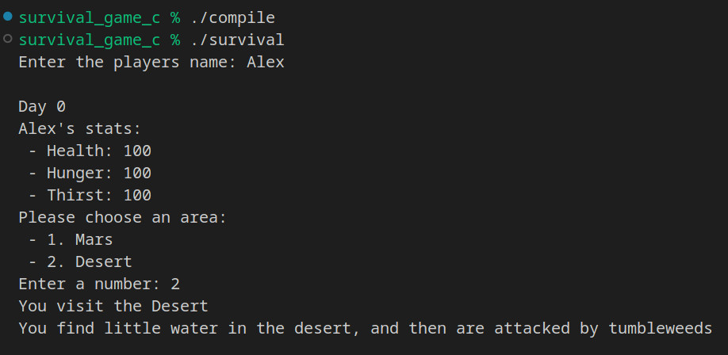

# Survival Game C

Create a Survival Game in C that runs in the command line. Explore several concepts in C such as header guards, initializing arrays, compiling multiple files, etc.

## Navigation

|             Item             |  Description  |
|------------------------------|---------------|
| [compile](./compile)         | Compilation script for Unix (MacOS, Linux, BSD, etc.) |
| [compile.bat](./compile.bat) | Compilation script for Windows |
| [main.c](./main.c)           | Main file which contains the main function |
| [place.h](./place.h)         | Stores information about places to visit in the game. |
| [player.h](./player.h)       | Stores player information, and what the player can do. |
| [player.c](./player.h)       | Stores player information, and what the player can do. |

